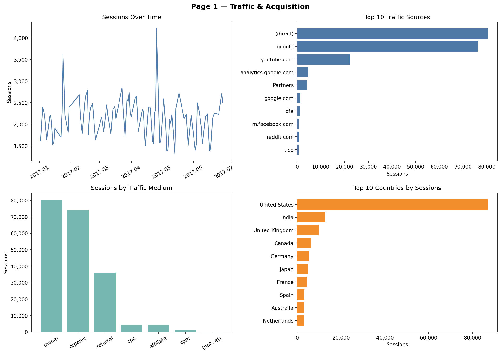
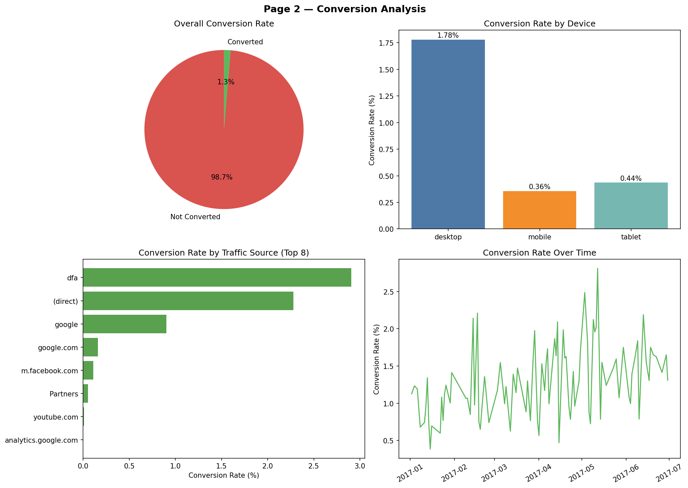
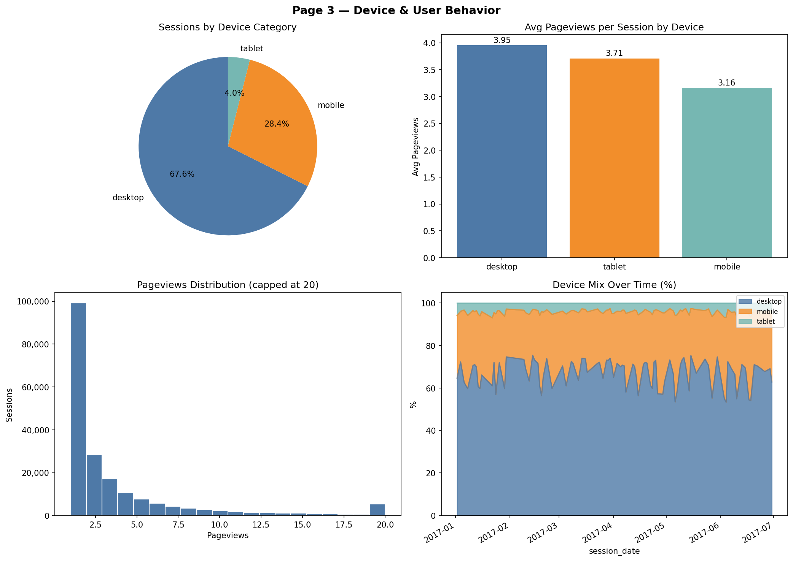

# EcomAnalytics — Web Sessions Data

## Nguồn dữ liệu
Project này sử dụng **Google Analytics Sample dataset** từ BigQuery Public Datasets. Bộ dữ liệu chứa dữ liệu Google Analytics 360 đã được ẩn danh/làm mờ từ **Google Merchandise Store**, một website thương mại điện tử của Google. Dù không phải dữ liệu thô nguyên bản, dữ liệu vẫn phản ánh tương đối thực tế hành vi người dùng trên website e-commerce, bao gồm phiên truy cập, nguồn traffic, thiết bị, quốc gia, lượt xem trang, giao dịch và doanh thu.

Export từ Google BigQuery, chứa dữ liệu hành vi người dùng trên website thương mại điện tử.

- **File gốc:** `bq-results-20260419-043458-1776573372834.csv`
- **Số dòng:** ~200,000 phiên truy cập
- **Thời gian:** bắt đầu từ 2017-06-18

## Bảng: `web_sessions`

| Cột | Kiểu | Mô tả |
|-----|------|-------|
| `session_date` | DATE | Ngày diễn ra phiên truy cập |
| `visitor_id` | VARCHAR | ID định danh người dùng |
| `visit_id` | BIGINT | ID phiên truy cập |
| `visits` | INT | Số lần truy cập |
| `pageviews` | INT | Số trang đã xem trong phiên |
| `transactions` | INT | Số giao dịch thực hiện |
| `transaction_revenue` | FLOAT | Doanh thu từ giao dịch |
| `traffic_source` | VARCHAR | Nguồn traffic (e.g. google, direct) |
| `traffic_medium` | VARCHAR | Kênh traffic (e.g. organic, referral) |
| `device_category` | VARCHAR | Loại thiết bị (desktop, mobile, tablet) |
| `country` | VARCHAR | Quốc gia của người dùng |
| `is_converted` | TINYINT | 1 = có giao dịch, 0 = không |

## Lưu ý
- `is_converted = 1` khi `transactions > 0`
- Dữ liệu được import vào SQL Server database `EcomAnalytics`

## Phân tích trực quan

### Traffic Acquisition

### Conversion Analysis

### Device Behavior

